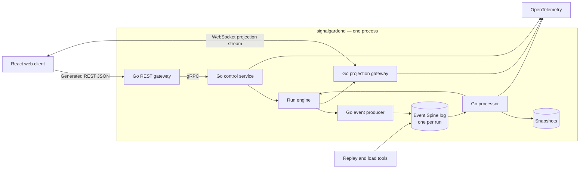

# Signal Garden Architecture

## Runtime Topology

The event path is in-process by [0004](decisions/0004-event-spine-replaces-kafka-as-the-event-backbone.md): the log is a library, not a broker. The boxes inside the daemon keep their responsibilities and stop being candidate process boundaries. The gRPC and REST boundary between the client and the daemon is unchanged.

## Service Responsibilities

| Service | Responsibility | State authority |
| --- | --- | --- |
| Control service | Start runs, validate controls, pause, finish, expose run metadata | Run lifecycle and control revisions |
| Event producer | Turn accepted controls into deterministic domain events | None; emits commands/events |
| Event log | Durably hold every event of a run, in order, and redeliver on restart | The run's event history |
| Processor | Validate, order, deduplicate, and apply events | Garden projection state |
| Projection gateway | Fan out snapshots over WebSockets and serve reconnect catch-up | Connection state only |
| REST gateway | Generated public HTTP/JSON adapter over gRPC | None |
| Replay/load tools | Reproduce fixtures and generate controlled pressure | None |

## Boundary Rules

- Business APIs are defined in protobuf and served internally over gRPC.
- Public HTTP/JSON routes are generated from the same protobuf definitions with grpc-gateway or an equivalent generator.
- WebSockets are a projection/read stream, not a second command API. Commands go through gRPC or generated REST.
- The [Event Spine](https://github.com/DamoDCoder/event-spine) log is the durable event transport from M2. The in-memory bus it replaces was permitted only for M0.
- One log per run, owned by that run's goroutine. The log takes no locks, so nothing may touch it from outside — see [0005](decisions/0005-one-log-per-run-owned-by-the-run-goroutine.md). Reconnect catch-up reads the log, so it is a command handed to the run rather than a second reader: the projection gateway asks, and the run's own goroutine answers.
- A reconnecting client is handed its missed records and the snapshot standing at the end of them in one pass of that goroutine, which is what makes the handover exact rather than approximately current.
- Run logs are never compacted. Events are cumulative deltas, so dropping superseded records changes the garden — see [0007](decisions/0007-never-compact-a-run-log.md).
- Delivery is at-least-once. The processor deduplicates on the idempotency key in [events.md](events.md); nothing depends on exactly-once.
- The processor is the authority for garden state. Clients render projections and do not calculate authoritative outcomes.
- Snapshots bound replay cost and hold run metadata; the event log remains the source for replay.
- Metrics and traces are emitted at service boundaries and correlated with run ID and event ID.

## Initial Deployment Shape

One container for `signalgardend`, one for the React development server. The event log is a library inside the daemon, so it needs a mounted data directory rather than a service of its own. Keep the topology simple enough to inspect with ordinary Docker Compose commands.