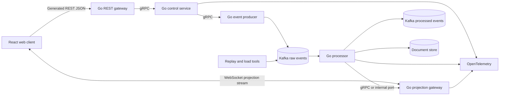

# Signal Garden Architecture

## Runtime Topology

## Service Responsibilities

| Service | Responsibility | State authority |
| --- | --- | --- |
| Control service | Start runs, validate controls, pause, finish, expose run metadata | Run lifecycle and control revisions |
| Event producer | Turn accepted controls into deterministic domain events | None; emits commands/events |
| Processor | Validate, order, deduplicate, and apply events | Garden projection state |
| Projection gateway | Fan out snapshots and telemetry over WebSockets | Connection state only |
| REST gateway | Generated public HTTP/JSON adapter over gRPC | None |
| Replay/load tools | Reproduce fixtures and generate controlled pressure | None |

## Boundary Rules

- Business APIs are defined in protobuf and served internally over gRPC.
- Public HTTP/JSON routes are generated from the same protobuf definitions with grpc-gateway or an equivalent generator.
- WebSockets are a projection/read stream, not a second command API. Commands go through gRPC or generated REST.
- Kafka is the durable event transport at M2; the in-memory adapter is permitted only for M0.
- The processor is the authority for garden state. Clients render projections and do not calculate authoritative outcomes.
- Document storage contains snapshots and run metadata; the event log remains the source for replay.
- Metrics and traces are emitted at service boundaries and correlated with run ID and event ID.

## Initial Deployment Shape

Use one container per Go service once M1 begins, plus Kafka, a Kafka-compatible local dependency if needed, the document store, and the React development server. Keep the topology simple enough to inspect with ordinary Docker Compose commands.